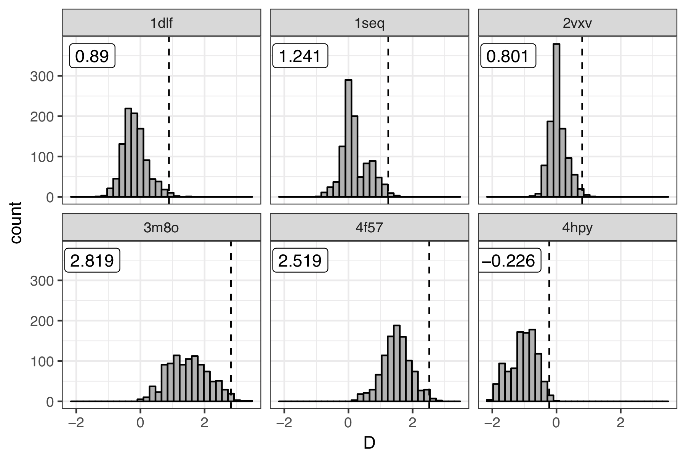
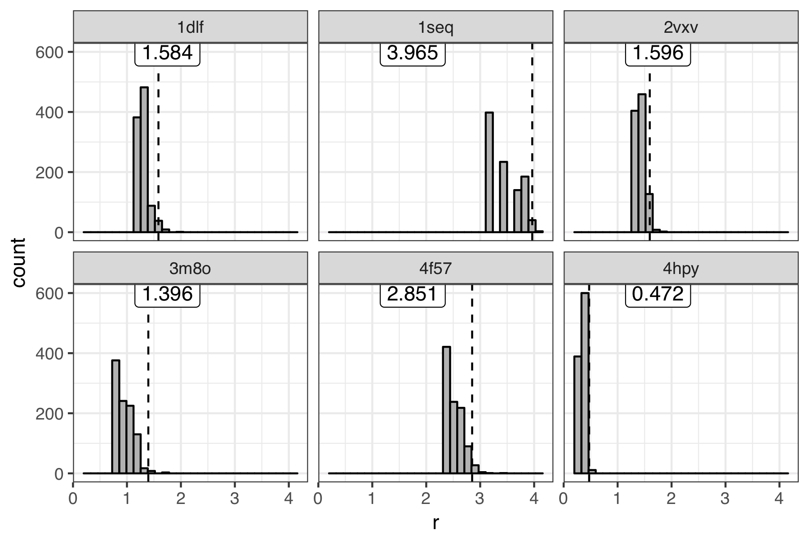
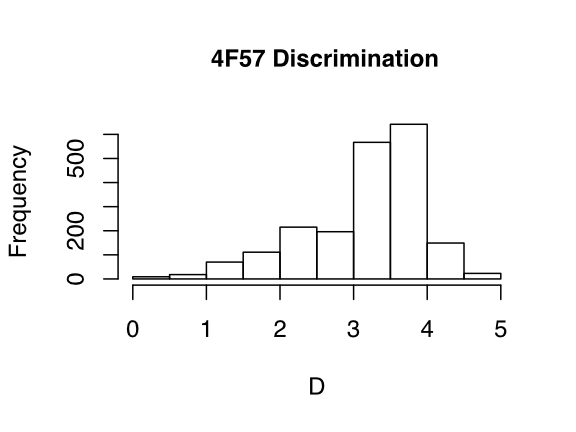

#==> EDIT HERE: FILL IN ALL SECTIONS AND REMOVE THIS LINE
## AUTHOR AND DATE
Antibody CDR-H3 loop modeling scientific test first implemented June, 2019 by Jeliazko Jeliazkov (Gray Lab, JHU, jeliazkov@jhu.edu).

## PURPOSE OF THE TEST
This test seeks to evalute the executable antibody\_h3. This application models the CDR-H3 loop (typically on homology frameworks, but also on crystal structures). Here we test its ability to predict loop conformation on crystal structures by evaluating minimum rmsd and discrimination. Minimum RMSD indicates whether or not we are sampling native-like loop conformations. Discrimination indicates whether the score function can distinguish native from non-native. Both metrics are compared to 99-th percentile value determined by bootstrap resampling of previous simulations.

## BENCHMARK DATASET
The dataset comprises six antibody targets from Weitzner and Gray (<a href=http://www.jimmunol.org/content/early/2016/11/18/jimmunol.1601137>J. Immunol. 2016</a>). The targets are of varying difficulty. Native structures are un-relaxed crystals. Inputs for modeling are relaxed with constraints (no ramping).

## PROTOCOL
The Rosetta Antibody CDR-H3 loop modeling protocol is describe in our publication (Weitzner, Jeliazkov, Lyskov, et al., <a href=https://www.ncbi.nlm.nih.gov/pmc/articles/PMC5739521> Nat. Protocol. 2017</a>): 

Briefly, this protocol has three stages (1) de novo CDR-H3 loop modeling, (2) VH-VL orientation refinement, (3) CDR-H3 loop refinement. Throughout the protocol the CDR-H3 loops is constrained to occupy the kink conformation observed in ~90% of antibodies. The benchmark is rather time consuming, taking ~1 hour per model. We aim to produce 500 models for 6 antibodies, so the runtime is 3000 CPU hours.

## PERFORMANCE METRICS
To consider a run successful, for antibody\_h3 run, we would like to produce a low energy, low rmsd model. Thus we need to assess two measures: (1) minimum rmsd acheived (do we sample a native like state) and (2) discrimination (do low rmsd models have low scores). We derive cutoffs for these metric from bootstrap resampling previous simulations (see below). The discrimnation or minimum rmsd test for each antibody is "passed" if the value is lower than that observed in 99% of our resampled simulations.

Initial runs on the benchmark server showed worse than expected results for 4F57. Further resampling the discrimination scores resulted in a new target D=4.52. See figure below for the 4F57 discrimination scores resampled from a server run.

## KEY RESULTS
Antibody CDR-H3 loop structure prediction is a challenging task. The current test assesses two easy, two medium, and two hard targets. For the easy/medium cases we expect a minimum rmsd between 0 and 2 Angstroms, whereas for the hard cases the rmsd will be greater than that. We expect discrimination to always be below zero for 4hpy. For 1dlf and 2vxv, discrimination should be below 1. For the others discrimination is not good as will fall between 1 and 3.

## DEFINITIONS AND COMMENTS
This test is a first stab at an antibody CDR-H3 loop modeling scientific test. More work should be done to determine better targets (other Abs? more Abs? different protocol?) and metrics.

## LIMITATIONS
The full assessments for Rosetta Antibody typically cover the entire protocol from homology modeling to H3 modeling and consist of ~50 targets. Due to time considerations, we obviously do not test the full protocol over 50 antibodies here. Instead we focus on the crucial H3 modeling stage.
