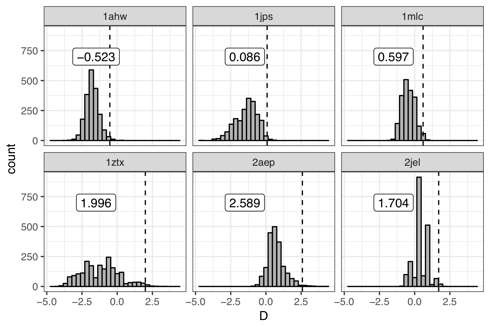
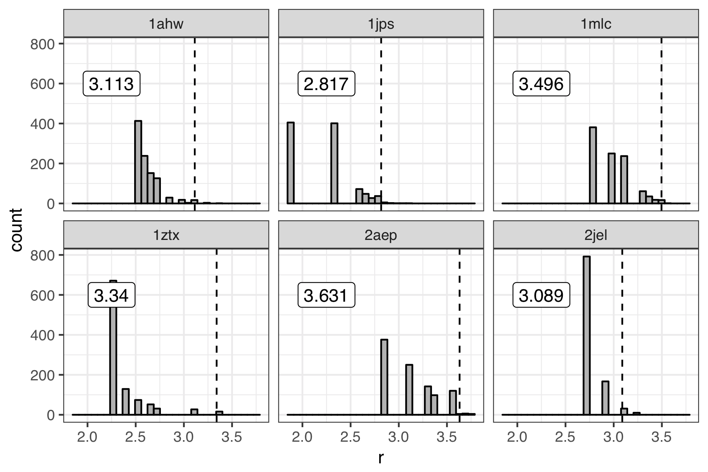
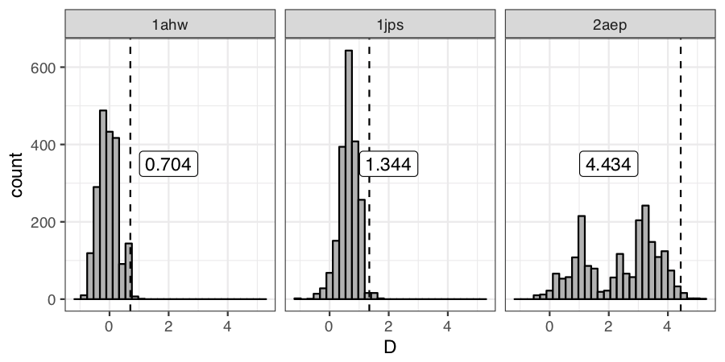

#==> EDIT HERE: FILL IN ALL SECTIONS AND REMOVE THIS LINE
## AUTHOR AND DATE
Antibody SnugDock scientific test first implemented June, 2019 by Jeliazko Jeliazkov (Gray Lab, JHU, jeliazkov@jhu.edu).

## PURPOSE OF THE TEST
This test seeks to evalute the executable snugdock. This application ... 

Here we test its ability to predict ..., from homology models by evaluating minimum rmsd and discrimination. Minimum RMSD indicates whether or not we are sampling native-like interfaces. Discrimination indicates whether the score function can distinguish native from non-native. Both metrics are compared to 99-th percentile value determined by bootstrap resampling of previous simulations.

## BENCHMARK DATASET
The dataset comprises six antibody targets from Sircar and Gray (<a href=https://journals.plos.org/ploscompbiol/article?id=10.1371/journal.pcbi.1000644>PLoS Comp. Bio. (2010)</a>). The targets are of varying difficulty. Native structures are crystals, slight altered (delete residues here and there) for rmsd calculations. Inputs for modeling are RosettaAntibody homology models and relaxed (unbound when possible) antigen.

## PROTOCOL
The Rosetta SnugDock protocol is described in our publication (Weitzner, Jeliazkov, Lyskov, et al., <a href=https://www.ncbi.nlm.nih.gov/pmc/articles/PMC5739521> Nat. Protocol. 2017</a>): 

Briefly, this protocol ... 

The benchmark is rather time consuming, taking ~1 hour per model. We aim to produce 500 models for 6 antibodies, so the runtime is 3000 CPU hours.

## PERFORMANCE METRICS
To consider a run successful,  we would like to produce a low energy, low rmsd model. Thus we need to assess two measures: (1) minimum rmsd acheived (do we sample a native like state) and (2) discrimination (do low rmsd models have low scores). We derive cutoffs for these metric from bootstrap resampling previous simulations (see below). The discrimnation or minimum rmsd test for each antibody is "passed" if the value is lower than that observed in 99% of our resampled simulations.

Initial runs on the benchmark server showed worse than expected results for 1AHW, 1JPS, and 2AEP. Further resampling the discrimination scores resulted in new targets D=0.72, 1.25, and 4.42. See figure below for the discrimination scores resampled from a server run.

An alternative approach to improve the stability of this test might be calculating an average discrimintion value after resample the 500 models...

## KEY RESULTS
Antibody--antigen bound structure prediction is a challenging task. The current test assesses ...

## DEFINITIONS AND COMMENTS
This test is a first stab at a SnugDock scientific test. More work should be done to determine better targets (other Abs? more Abs? different protocol?) and metrics.

## LIMITATIONS
The full assessment for Rosetta SnugDock typically covers the entire protocol from homology modeling to H3 modeling to antigen docking and consists of 15 targets. Due to time considerations, we obviously do not test the full protocol over 15 antibody-antigen complexes here. Instead we focus on six representative targets.
