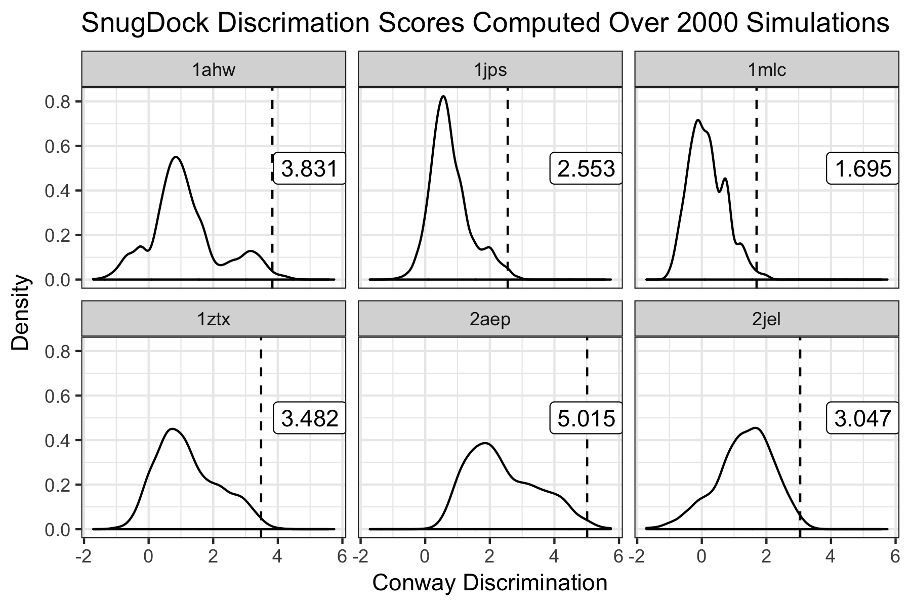
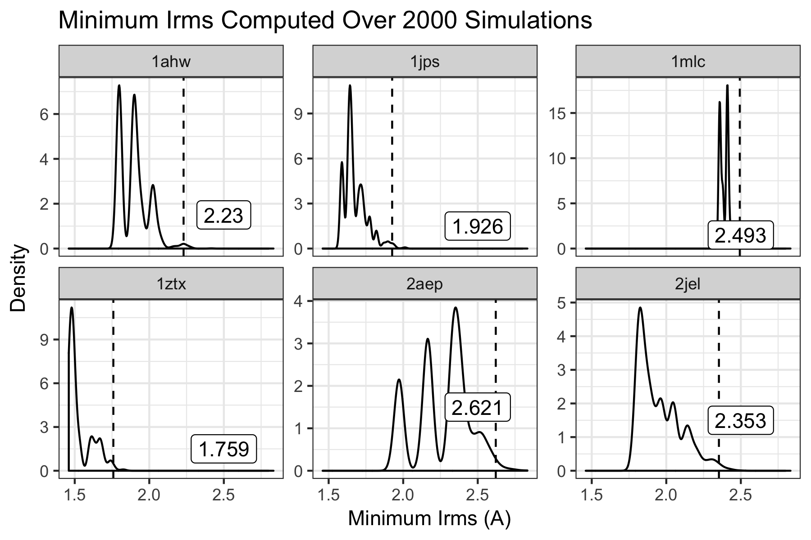

## AUTHOR AND DATE
Antibody SnugDock scientific test first implemented June, 2019 by Jeliazko Jeliazkov (Gray Lab, JHU, jeliazkov@jhu.edu).

## PURPOSE OF THE TEST
This test seeks to evalute the executable snugdock. Briefly, this application simulates antibody--antigen interactions by local docking with CDR loop refinement. A simulation consists of fifty cycles of randomly selected moves, including, re-docking the relative orientation of the VH--VL and Ab--Ag are refined, remodeling the CDR H3/H2 loops in the context of the Ag interaction, side-chain repacking, and minimization of all relevant DOF (Ab--Ag interface, VH--VL interface, CDR loops, and side chains).

Here we test the protocol's ability to predict Ab--Ag interactions starting from ensembles of homology models and the unbound antigen crystal structure (when possible) by evaluating minimum rmsd and discrimination. Minimum RMSD indicates whether or not we are sampling native-like interfaces. Discrimination indicates whether the score function can distinguish native from non-native. Both metrics are compared to 99-th percentile value determined by bootstrap resampling of previous simulations.

## BENCHMARK DATASET
The dataset comprises six antibody targets from Sircar and Gray (<a href=https://journals.plos.org/ploscompbiol/article?id=10.1371/journal.pcbi.1000644>PLoS Comp. Bio. (2010)</a>). The targets are of varying difficulty (1AHW, 1JPS, 1MLC, and 1ZTX should be relatively easy - either sampling near-native states or having a funnel - whereas 2AEP and 2JEL should be challenging - no funnel, no near-native sampling). Native structures are crystals. Inputs for modeling are RosettaAntibody homology models and relaxed (unbound when possible) antigen.

## PROTOCOL
The Rosetta SnugDock protocol is described in our publication (Weitzner, Jeliazkov, Lyskov, et al., <a href=https://www.ncbi.nlm.nih.gov/pmc/articles/PMC5739521> Nat. Protocol. 2017</a>). The benchmark is rather time consuming, taking ~1 hour per model. We aim to produce 500 models for 6 antibodies, so the runtime is 3000 CPU hours.

## PERFORMANCE METRICS
To consider a run successful,  we would like to produce a low energy, low rmsd model. Thus we need to assess two measures: (1) minimum rmsd achieved (do we sample a native like state) and (2) discrimination (do low rmsd models have low scores). We use discrimination (typically lower is better, ideally negative values) as defined by Conway et al. <a href=https://www.ncbi.nlm.nih.gov/pubmed/24265211> Prot. Sci 2014</a>, although our rmsd bins have adjusted spacing at min(rmsd) + (0, 0.5, 1, 1.5, 2, 4). We derive cutoffs for these metric from bootstrap resampling previous simulations (see below). The discrimnation or minimum rmsd test for each antibody is "passed" if the value is lower than that observed in 99% of our resampled simulations +0.1A.

## KEY RESULTS
Antibody--antigen bound structure prediction is a challenging task. The current test assesses only six of a possible fifteen targets, which should display a breadth of behavior. For the easier targets (1AHW, 1JPS, 1MLC, and 1ZTX) we expect to observe either near-native (sub 2-Angstrom) sampling of the interface or a good funnel (negative discrimintation). For the harder targets (2AEP and 2JEL) we will not observe either.

## DEFINITIONS AND COMMENTS
This test is a first stab at a SnugDock scientific test. More work should be done to determine better targets (other Abs? more Abs? different protocol?) and metrics.

## LIMITATIONS
The full assessment for Rosetta SnugDock typically covers the entire protocol from homology modeling to H3 modeling to antigen docking and consists of 15 targets. Due to time considerations, we obviously do not test the full protocol over 15 antibody-antigen complexes here. Instead we focus on six representative targets.
