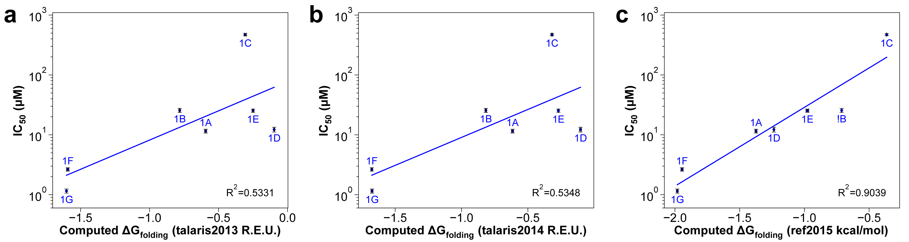

## AUTHOR
Vikram K. Mulligan (vmulligan@flatironinstitute.org), Center for Computational Biology, Flatiron Institute, 5 June 2020.

## PURPOSE OF THE TEST

When designing peptides to bind to targets, the flexibility of the peptide is a major impediment to binding.  This is because there is an entropic cost associated with ordering a disordered molecule on binding.  A rigidly-structured peptide that is pre-organized in the binding-competent conformation has a lower entropic cost and can bind more tightly.  When interactions between peptide and target have been optimized with Rosetta, peptide rigidity becomes the major determininant of binding affinity.  Rosetta predictions of peptide folding propensity, carried out with the simple\_cycpep\_predict application, correlate strongly with experimentally-measured binding affinity, at least with the ref2015 energy function.  This correlation has improved from talaris2013 through talaris2014 to ref2015 due to improved training of the energy function against physical properties of fluids and against fluid MD  simulation (see image below).  This test exists to ensure that this correlation between prediction and experiment is maintained with future versions of the energy function and with future releases of Rosetta.

#### What does the benchmark test and why?

This test benchmarks seven peptides that were previously designed to bind to and inhibit the New Delhi metallo-beta-lactamase 1 (NDM-1).  (For our purposes, IC50 values for these competitive inhibitors, measured at a constant concentration of the substrate of the reaction being inhibited, are proportional to inhibitor binding affinity.)  The test carries out the following steps:

1.  Large-scale conformational sampling for each of the seven peptides.
2.  From the energy landscape sampled, calculation of the metrics PNear and estimated Delta-G of folding (which are closely-relarted measures of propensity to be rigid in the binding-competent conformation).
3.  Plotting of the logarithm of experimentally-measured IC50 values against the computed Delta-G of folding values computed in the previous step.
4.  Fitting of these data to a simple linear model, and extraction of the R-squared value for the fit.

The R-squared value should not drop below 0.85.

## BENCHMARK DATASET

#### How many proteins are in the set?

- Seven peptides, named NDM1i-1A through NDM1i-1G.  (These were previously called 8res1B, 8res2, 8res3, Holmes, Holmes_l8p, Adler, and Moriarty, respectively).  All have been synthesized, the IC50 value for each binding to and inhibiting the NDM-1 enzyme's hydrolysis of nitrocefin have been measured.

#### What dataset are you using? Is it published? If yes, please add a citation.

- These peptides are described in Mulligan _et al._ (2020).  Computationally-designed peptide macrocycle inhibitors of New Delhi metallo-beta-lactamase 1.  Manuscript in preparation.

#### What are the input files? How were the they created?

- The input for each structure prediction run is the peptide, designed with Rosetta, in PDB format, along with its sequence in ASCII text format.
- The input for the correlation analysis is the set of output Delta-G of folding values from the structure prediction runs, plus an experimentally-measured set of IC50 values.

## PROTOCOL
#### State and briefly describe the protocol.

The simple\_cycpep\_predict application uses the generalized kinematic closure algorithm (GenKIC) to rapidly sample closed conformations of a heteropolymer macrocycle built from any combination of alpha-amino acids, peptoids, or other related building-blocks.  Each closure attempt is relaxed using the FastRelax protocol.  For small (~8 to ~10 residue) peptide macrocycles, the application can usually sample close to the native state with less expense than protein _ab initio_.

The simple\_cycpep\_predict application supports hierarchical MPI-based job distribution and data reduction, as well as multi-threaded parallel job execution within a node.  In MPI mode, statistics about the full sampled ensemble, including the funnel quality metric PNear, are computed automatically during the data collection and reduction phase.

#### Is there a publication that describes the protocol?

The simple\_cycpep\_predict application is described in the following publications:

1.  Bhardwaj G, Mulligan VK,  Bahl CD, _et al._ (2016).  Accurate de novo design of hyperstable constrained peptides.  _Nature_ 538(7625):329-35.

2.  Hosseinzadeh P, Bhardwaj G, Mulligan VK, _et al._ (2018).  Comprehensive computational design of ordered peptide macrocycles.  _Science_ 358(6369):1461-6.

3.  Mulligan _et al._ (2020).  Computationally-designed peptide macrocycle inhibitors of New Delhi metallo-beta-lactamase 1.  Manuscript in preparation.

#### How many CPU hours does this benchmark take approximately?

Approximately 400 CPU-hours.  The test runs on 4 nodes, 20 cores per node, for roughly 5 wall hours.

In debug mode, this test takes approximately 10 CPU-hours (1 node, 20 cores, for 0.5 wall hours).

## PERFORMANCE METRICS

#### What are the performance metrics used and why were they chosen?

All of the following must be true for the test to pass:

- More than 18,000 successful samples (200 in debug mode).
- Lowest-RMSD sample within a threshold RMSD of the design model.  (Varies by peptide.)
- Highest-RMSD sample outside of a thrshold RMSD of the design model.  (Varies by peptide.)
- Lowest-energy sample within a threshold RMSD of the design model.  (Varies by peptide.)
- Energy gap (gap between lowest-energy sample > 1.5 A and overall lowest) bigger than a threshold value.  (Varies by peptide.)
- PNear greater than a threshold value.  (Varies by peptide.)
- Most importantly, R-squared value for the linear relationship between ln(IC50) and Delta-G of folding is greater than 0.85.

#### How do you define a pass/fail for this test?

Failure of any of the above results in an overall failure.

#### How were any cutoffs defined?

These are based on Rosetta performance as of 5 June 2020.  The observed R-squared value reported in Mulligan _et al._ (2020) is 0.9.

## KEY RESULTS

#### What is the baseline to compare things to - experimental data or a previous Rosetta protocol?

Past iterations of this test and performance reported in Mulligan _et al._ (2020).  (See Figure 3 in that paper.)

#### Describe outliers in the dataset.

NDM1i-1C should have the lowest PNear value and highest Delta-G of folding; NDM1i-1F and NDM1i-1G should have the highest PNear value and lowest Delta-G of folding.  These are the worst and best binders, respectively.

## DEFINITIONS AND COMMENTS

#### State anything you think is important for someone else to replicate your results.

For full reproducibility, see the 92-page supplement to Mulligan _et al._ (2020).

## LIMITATIONS

#### What are the limitations of the benchmark? Consider dataset, quality measures, protocol etc.

The parameters of the correlation are expected to vary from target to target, and for any given target, there are very few data.  (Chemically synthesizing a candidate peptide binder and testing its affinity are inherently low-throughput experimental techniques.)

#### How could the benchmark be improved?

More peptides, and more targets.

#### What goals should be hit to make this a "good" benchmark?

Well, I think it's pretty good as it is.
